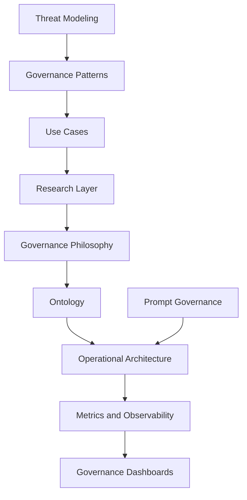

# Responsible AI Business Architecture

# Architecture Navigation Map

> AI may be probabilistic. Responsibility must not be.

---

# Purpose

This document provides a structured navigation map of the Responsible AI Business Architecture framework.

The objective is to help:

- business owners;
- enterprise architects;
- governance teams;
- researchers;
- consultants;
- AI agents;
- contributors

understand the architecture, concepts, and relationships across the project ecosystem.

---

# Framework Mission

Responsible AI Business Architecture explores how organizations can adopt autonomous and AI-assisted systems while preserving:

- operational controllability;
- human accountability;
- auditability;
- escalation integrity;
- governance visibility;
- safe operational autonomy.

---

# Core Strategic Thesis

The future advantage will not belong only to organizations that automate fastest.

It will belong to organizations that can govern autonomy most effectively.

---

# Framework Structure

## 1. Vision and Strategic Positioning

### Documents

- `README.md`
- `START-HERE.md`
- `QUICK-CHECK.md`
- `whitepaper/governable-autonomy-manifesto.md`
- `presentations/executive-brief.md`

### Focus

- framework vision;
- strategic positioning;
- business value;
- executive communication;
- governable autonomy concept.

---

# 2. Governance Philosophy

### Documents

- `docs/governance-design-principles.md`
- `docs/governance-ontology.md`
- `research/ai-governance-open-questions.md`

### Focus

- governance principles;
- semantic vocabulary;
- operational philosophy;
- unresolved governance questions;
- controllability concepts.

---

# 3. Operational Governance Architecture

### Documents

- `docs/reference-architecture.md`
- `docs/visual-architecture-layer.md`
- `docs/operational-controllability.md`
- `docs/governance-dashboard.md`
- `demo/governance-dashboard-v2.html`

### Focus

- governance layers;
- operational visibility;
- controllability models;
- governance dashboards;
- escalation flows;
- audit architecture.

---

# 4. Governance Risk and Threat Modeling

### Documents

- `docs/failure-modes.md`
- `docs/mcp-threat-model.md`
- `docs/project-risk-and-safety-governance.md`
- `use-cases/custom-mcp-business-risk.md`

### Focus

- governance failure modes;
- prompt injection;
- MCP governance;
- cross-tool exfiltration;
- governance drift;
- operational risk.

---

# 5. Prompt and Instruction Governance

### Documents

- `docs/prompt-governance-architecture.md`

### Focus

- instruction hierarchy;
- prompt governance;
- reusable prompts;
- prompt-layer governance drift;
- governance engineering;
- instruction authority models.

---

# 6. Governance Patterns and Operational Models

### Documents

- `patterns/human-confirmation-gate.md`
- `patterns/permission-ring-model.md`
- `patterns/governance-observer-pattern.md`
- `patterns/human-override-layer.md`

### Focus

- reusable governance patterns;
- escalation models;
- operational safeguards;
- controllable AI execution.

---

# 7. Metrics and Observability

### Documents

- `metrics/controllability-index.md`
- `metrics/governance-drift-score.md`
- `metrics/escalation-integrity.md`
- `metrics/audit-completeness.md`

### Focus

- governance telemetry;
- operational measurement;
- drift detection;
- escalation quality;
- auditability metrics.

---

# 8. Standards and Compliance Alignment

### Documents

- `docs/nist-ai-rmf-alignment.md`
- `docs/iso42001-alignment.md`
- `docs/eu-ai-act-alignment.md`

### Focus

- operational interpretation of standards;
- governance mapping;
- enterprise implementation guidance.

---

# 9. Use Cases and Business Scenarios

### Documents

- `use-cases/customer-support-agent.md`
- `use-cases/finance-approval-agent.md`
- `use-cases/custom-mcp-business-risk.md`

### Focus

- practical governance scenarios;
- real operational examples;
- AI-agent deployment risks;
- escalation requirements.

---

# 10. Research and Future Directions

### Documents

- `research/ai-governance-open-questions.md`

### Focus

- unresolved governance problems;
- research directions;
- future operational models;
- AI-native governance challenges.

---

# Key Framework Concepts

| Concept | Meaning |
|---|---|
| Governable Autonomy | Autonomous systems operating inside governance boundaries |
| Operational Controllability | Ability to observe, intervene, and contain AI operations |
| Governance Drift | Divergence between intended and real operational behavior |
| Escalation Integrity | Reliability of transferring uncertainty to humans |
| Invisible AI Influence | Undetected operational steering by AI systems |
| Reversible Autonomy | Autonomous actions that can be interrupted or rolled back |
| Prompt Governance | Governance of instruction architecture and prompt systems |

---

# Architectural Relationships

---

# Intended Audience

This framework is intended for:

- enterprise leaders;
- business owners;
- governance teams;
- enterprise architects;
- AI consultants;
- risk managers;
- auditors;
- researchers;
- AI-agent governance designers.

---

# Strategic Interpretation

This repository is intended to evolve into:

- governance methodology;
- operational governance framework;
- controllability architecture system;
- AI governance knowledge ecosystem;
- research initiative for governable autonomy.

---

# Strategic Principle

The sustainability of autonomous AI systems depends on whether organizations can preserve operational controllability while autonomy scales.
