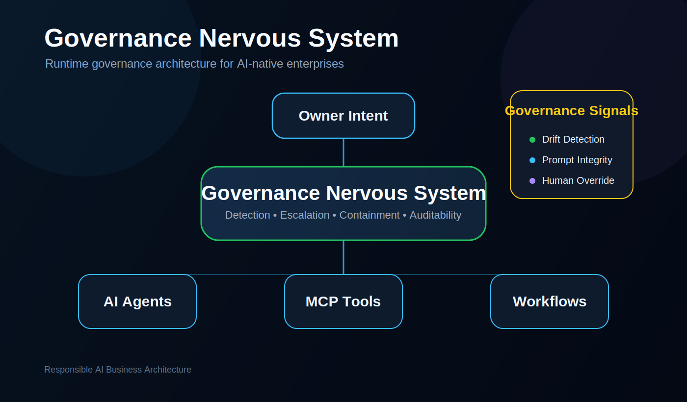
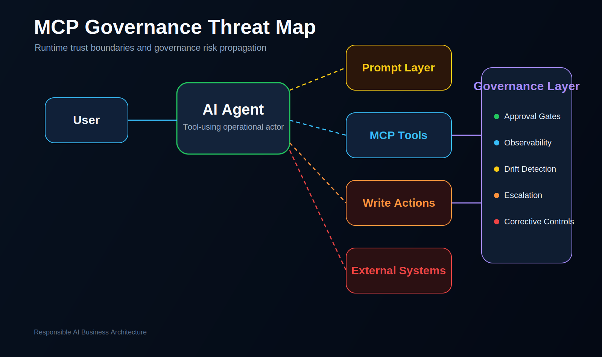

# Responsible AI Business Architecture

## From AI Control to Human–AI Coordination

> **AI may be probabilistic. Responsibility must not be.**

Artificial intelligence is rapidly moving from assistance to execution.

AI systems are increasingly becoming operational participants inside:

- business workflows;
- enterprise systems;
- real-time operational environments;
- distributed decision architectures.

Most organizations are not prepared for this transition.

The challenge is evolving:

from:

- controlling AI systems

toward:

- designing governable operational environments where humans, organizations and autonomous AI systems can coordinate responsibly.

---

## Core Idea

> **We do not try to fully control intelligence.**
>
> **We design governable operational environments where humans, organizations and autonomous AI systems can cooperate responsibly.**

Responsible AI Business Architecture is an open-source research and architecture initiative exploring the future of operational governance, human-AI coordination and cooperative autonomy in AI-native organizations.

---

## This Project Is a Discussion Space, Not a Finished Doctrine

Responsible AI Business Architecture is not presented as a final answer.

It is a structured space for serious discussion, practical exploration and collaborative development around one of the most important operational questions of the coming years:

> **How can humans and AI systems work together effectively without losing responsibility, oversight and control?**

We do not assume that one person, one company or one framework already has the complete solution.

Instead, this project invites practitioners, researchers, business owners, technologists, consultants, governance specialists, operational leaders and frontline users to help build this direction together.

The goal is to develop shared language, practical models, use cases, assessment tools and governance patterns for Human-AI Operational Coordination.

---

## Living Human-AI Operational Interface

Human-AI Operational Coordination cannot be reduced to a static framework, checklist or one-time implementation.

It is a living, resource-intensive and continuously evolving operational process.

As AI systems become more capable, faster and more autonomous, the interface between humans and AI must evolve even faster — not as a technical add-on, but as a dynamic coordination system shaped by:

- desired outcomes;
- real operational feedback;
- changing risk conditions;
- human responsibility;
- cross-functional expertise.

This interface requires participation from multiple domains:

- business owners;
- operational managers;
- AI specialists;
- legal and governance experts;
- frontline employees;
- process designers;
- security specialists;
- end users.

No single discipline can solve this alone.

The interface between humans and AI must become a living governance environment: continuously updated, tested, corrected and improved as the organization learns what AI is actually doing inside its real operations.

> The goal is not to control AI once.
>
> The goal is to maintain governability over time.

---

## Why This Matters

As AI autonomy increases:

- operational speed increases;
- workflow complexity increases;
- coordination difficulty increases;
- human visibility decreases.

Human management structures may eventually become slower than autonomous operational environments.

This creates a new challenge:

## Coordination Asymmetry

The future problem may not be intelligence itself.

The future problem may be preserving:

- operational stability;
- accountability;
- intervention capability;
- human participation;
- governability.

---

## Core Architecture Areas

| Area | Meaning |
|---|---|
| **Governance Nervous System** | A real-time coordination and stabilization layer for AI-native operational environments |
| **Runtime Governance** | Governance during execution, not only retrospective auditing |
| **Corrective Governance** | Intervention, escalation and stabilization mechanisms for autonomous operations |
| **Human-AI Operational Interface** | Translation layer between machine-speed environments and human decision-makers |
| **Living Human-AI Operational Interface** | A continuously evolving coordination layer that adapts faster than the AI systems it helps govern |
| **AI Action Boundary Mapping** | A method for defining where AI may analyze, recommend, decide, draft, trigger or execute inside real workflows |
| **AI Governance Gateway** | A socio-technical gateway controlling AI access to actions, data and decisions through limits, logs, escalation and human accountability |
| **Personal AI Operational Twin** | A personalized AI work layer configured with a person's context, style, workflows and tools, requiring clear boundaries for delegated identity and responsibility |
| **Dynamic Governance Environment** | A governance environment that is continuously updated through feedback, testing, correction and desired outcomes |
| **Cooperative Autonomy** | Sustainable operational coexistence between humans, organizations and autonomous systems |
| **Governable Operational Environments** | Environments where AI may act autonomously while stability and accountability remain preserved |

---

## Current Research Areas

- AI-native operational systems
- runtime governance
- human-AI coordination
- coordination asymmetry
- operational visibility
- intervention architecture
- real-time governance systems
- AI-agent permissions
- AI action boundary mapping
- AI governance gateways
- personal AI operational twins
- delegated AI identity
- operational drift detection
- scalable oversight systems
- governance observability
- shared operational language
- living human-AI operational interfaces
- dynamic governance environments
- collaborative governance development

---

## Key Research Questions

- What happens when AI systems operate faster than human management structures?
- Can governance function at machine speed?
- How do organizations preserve operational clarity inside autonomous environments?
- What becomes the future interface between humans and AI systems?
- Which human qualities become most important in AI-native organizations?
- How do humans maintain accountability while operational autonomy scales?
- How can the human-AI interface evolve faster than the AI systems it coordinates?
- What governance gateways are needed before AI output becomes operational action?
- Where are the boundaries between AI analysis, recommendation, decision support, execution and accountability?
- When does a personalized AI assistant become a delegated operational identity?
- What kinds of cross-functional communities are needed to build effective human-AI operational coordination?

---

## Architecture Map

```text
Human Layer
  strategic intent • identity • accountability • intervention
        ↓
AI Action Boundary Mapping
  analysis • recommendation • decision support • execution • accountability
        ↓
Personal AI Operational Twin
  context • style • memory • drafts • recurring workflows
        ↓
Living Human-AI Operational Interface
  visibility • escalation • operational translation • feedback • continuous adaptation
        ↓
AI Governance Gateway
  access control • risk limits • logging • escalation • human approval
        ↓
Governance Nervous System
  telemetry • coordination • stabilization • corrective governance
        ↓
Operational AI Agents
  execution • workflows • local autonomy
        ↓
Execution Environment
  business processes • tools • systems • outcomes
```

---

## Executive Entry Points

| Start Here | Purpose |
|---|---|
| [`portal/executive-governance-portal.html`](portal/executive-governance-portal.html) | Executive-facing governance portal |
| [`whitepaper/governable-autonomy-whitepaper-v2.md`](whitepaper/governable-autonomy-whitepaper-v2.md) | Strategic whitepaper |
| [`docs/project-positioning.md`](docs/project-positioning.md) | Current project positioning |
| [`docs/evolution-from-control-to-coexistence.md`](docs/evolution-from-control-to-coexistence.md) | Conceptual evolution of the project |
| [`docs/governance-principles.md`](docs/governance-principles.md) | Core governance principles |
| [`docs/governance-vocabulary.md`](docs/governance-vocabulary.md) | Shared vocabulary |
| [`docs/concepts/living-human-ai-operational-interface.md`](docs/concepts/living-human-ai-operational-interface.md) | Living interface concept |
| [`docs/concepts/ai-action-boundary-mapping.md`](docs/concepts/ai-action-boundary-mapping.md) | Method for defining AI action, approval and accountability boundaries |
| [`docs/concepts/ai-governance-gateway.md`](docs/concepts/ai-governance-gateway.md) | Gateway pattern for AI access, actions and accountability |
| [`docs/concepts/personal-ai-operational-twin.md`](docs/concepts/personal-ai-operational-twin.md) | Personalized AI work layer and delegated identity governance |
| [`frameworks/ai-governance-readiness-assessment.md`](frameworks/ai-governance-readiness-assessment.md) | Governance readiness assessment |
| [`demo/governance-readiness-assessment.html`](demo/governance-readiness-assessment.html) | Interactive assessment demo |

---

## Core Concepts

### Governance Nervous System

The Governance Nervous System is the real-time coordination layer between human intent, organizational continuity and autonomous operational systems.

It is not a command-and-control mechanism.

It is a stabilization and translation layer for autonomous environments.

---

### Governable Operational Environments

The project does not assume that advanced autonomous systems can always be fully controlled internally.

Instead, it asks:

> Can the environment in which they operate remain observable, accountable, correctable and stable?

---

### Human-AI Operational Coordination

The future interface between humans and AI may depend less on direct control and more on shared operational language, visibility, escalation and coordinated intervention.

---

### Living Human-AI Operational Interface

The Human-AI Operational Interface is not a static control panel.

It is a living coordination environment that must be continuously updated through operational feedback, desired outcomes, emerging risks and cross-functional human expertise.

If AI systems learn, adapt and scale, governance cannot remain static.

---

### AI Action Boundary Mapping

AI Action Boundary Mapping defines where AI may analyze, recommend, decide, draft, trigger or execute inside real workflows.

It helps organizations distinguish productivity assistance from operational delegation before AI output becomes operational action.

Before AI acts, define where AI is allowed to act.

---

### AI Governance Gateway

The AI Governance Gateway is a socio-technical control point between AI systems and operational action.

It regulates what AI systems may access, recommend, trigger or modify — under which human authority, with which risk limits, logs, escalation rules and accountability structures.

It extends the logic of API gateways from technical access control toward responsibility-aware operational governance.

---

### Personal AI Operational Twin

A Personal AI Operational Twin is a personalized AI work layer configured with a person's context, writing style, documents, workflows and tools.

It may increase productivity, but it also creates a critical governance question: when does assistance become delegated operational identity?

Personalization increases usefulness. Delegation increases responsibility.

---

### Cooperative Autonomy

Cooperative autonomy means that autonomous systems can participate in shared operational environments without destroying human accountability, organizational continuity or operational clarity.

---

### Runtime Governance

Governance must increasingly operate during execution, not only after failure analysis.

Visibility without intervention is insufficient.

---

## Visual Architecture

<p align="center">
  
</p>

<p align="center">
  
</p>

---

## Repository Navigation

### Concepts

- [`docs/concepts/governance-nervous-system.md`](docs/concepts/governance-nervous-system.md)
- [`docs/concepts/cooperative-autonomy.md`](docs/concepts/cooperative-autonomy.md)
- [`docs/concepts/operational-governability.md`](docs/concepts/operational-governability.md)
- [`docs/concepts/coordination-asymmetry.md`](docs/concepts/coordination-asymmetry.md)
- [`docs/concepts/human-ai-operational-interface.md`](docs/concepts/human-ai-operational-interface.md)
- [`docs/concepts/living-human-ai-operational-interface.md`](docs/concepts/living-human-ai-operational-interface.md)
- [`docs/concepts/ai-action-boundary-mapping.md`](docs/concepts/ai-action-boundary-mapping.md)
- [`docs/concepts/ai-governance-gateway.md`](docs/concepts/ai-governance-gateway.md)
- [`docs/concepts/personal-ai-operational-twin.md`](docs/concepts/personal-ai-operational-twin.md)

### Evolution

- [`docs/evolution/from-control-to-coordination.md`](docs/evolution/from-control-to-coordination.md)
- [`docs/evolution-from-control-to-coexistence.md`](docs/evolution-from-control-to-coexistence.md)

### Architecture and Governance

- [`README-ARCHITECTURE.md`](README-ARCHITECTURE.md)
- [`architecture/governance-nervous-system.md`](architecture/governance-nervous-system.md)
- [`architecture/corrective-governance-layer.md`](architecture/corrective-governance-layer.md)
- [`docs/mcp-governance-principles.md`](docs/mcp-governance-principles.md)
- [`docs/governance-toolchain.md`](docs/governance-toolchain.md)
- [`docs/governance-observability.md`](docs/governance-observability.md)

### Security and Integrity

- [`SECURITY.md`](SECURITY.md)
- [`docs/governance-integrity.md`](docs/governance-integrity.md)
- [`docs/example-safety-policy.md`](docs/example-safety-policy.md)
- [`docs/incident-response-playbook.md`](docs/incident-response-playbook.md)

### Demos and Tools

- [`demo/governance-dashboard-v2.html`](demo/governance-dashboard-v2.html)
- [`demo/governance-readiness-assessment.html`](demo/governance-readiness-assessment.html)
- [`tools/suspicious-instruction-review-gate/README.md`](tools/suspicious-instruction-review-gate/README.md)

---

## Who This Is For

This project is intended for:

- enterprise architects;
- AI systems engineers;
- operations leaders;
- governance specialists;
- infrastructure architects;
- real-time systems engineers;
- AI-native product builders;
- organizational strategists;
- operational systems researchers;
- business owners;
- process designers;
- legal and compliance specialists;
- human-computer interaction researchers;
- frontline practitioners working with AI-enabled workflows.

---

## Relationship to Responsible AI

This project complements Responsible AI principles, AI risk frameworks and AI ethics discussions.

Its specific contribution is practical and architectural:

> turning Responsible AI into operational coordination architecture for AI-native organizations.

---

## Important Disclaimer

This project is an experimental governance architecture and research initiative.

It is not legal advice, a security certification, a compliance guarantee or complete protection against prompt injection, AI misuse or operational failure.

See [`DISCLAIMER.md`](DISCLAIMER.md) for limitations.

---

## Strategic Principle

The central question is no longer only:

> “What can AI do?”

or even:

> “How do we control AI?”

The deeper question is becoming:

> **How do humans, organizations and autonomous systems remain operationally coordinated as autonomy continues to scale?**

---

## Responsible AI Business Architecture

> **Governance must scale faster than autonomy.**

> **The human-AI interface must evolve faster than the AI systems it coordinates.**
