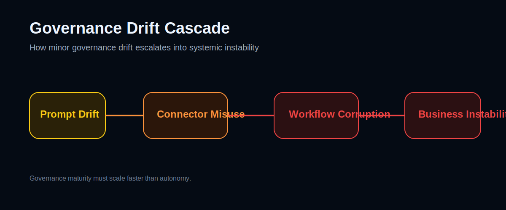

# Responsible AI Business Architecture

> **AI may be probabilistic. Responsibility must not be.**

**Deployment-level socio-technical governance architecture for AI-native enterprises.**

Responsible AI Business Architecture is an open framework for organizations deploying AI agents, MCP/connectors, autonomous workflows and AI-enabled business operations without losing operational control, auditability, accountability or business trust.

<p align="center">
  
</p>

---

## Executive Entry Points

| Start Here | Purpose |
|---|---|
| [`portal/index.html`](portal/index.html) | Executive-facing governance portal |
| [`README-ARCHITECTURE.md`](README-ARCHITECTURE.md) | Full architecture navigation map |
| [`whitepaper/governable-autonomy-manifesto.md`](whitepaper/governable-autonomy-manifesto.md) | Core manifesto and strategic framing |
| [`architecture/governance-nervous-system.md`](architecture/governance-nervous-system.md) | Runtime governance sensory layer |
| [`architecture/corrective-governance-layer.md`](architecture/corrective-governance-layer.md) | Intervention and containment model |
| [`use-cases/ai-agent-with-mcp.md`](use-cases/ai-agent-with-mcp.md) | Practical AI agent + MCP governance scenario |
| [`playbooks/ai-pilot-readiness-playbook.md`](playbooks/ai-pilot-readiness-playbook.md) | First pilot readiness playbook |
| [`tools/suspicious-instruction-review-gate/README.md`](tools/suspicious-instruction-review-gate/README.md) | Demo governance gate |

---

## The Business Problem

AI is moving from assistance to execution.

AI systems increasingly:

- read business data;
- recommend decisions;
- draft communications;
- use tools and connectors;
- influence workflows;
- trigger operational actions;
- interact with customers, employees, suppliers and internal systems.

This creates a new enterprise risk:

> **AI autonomy can scale faster than human oversight, governance and accountability.**

Without deployment-level governance architecture, organizations may face:

- invisible AI influence;
- silent permission expansion;
- prompt injection and connector misuse;
- escalation overload;
- approval fatigue;
- audit gaps;
- unclear responsibility;
- loss of owner-level operational visibility.

---

## What Makes This Different

This is not an “awesome list”, a policy collection or a generic AI ethics statement.

Responsible AI Business Architecture is intended as a **deployment-level blueprint** for governing AI-enabled business processes.

It combines:

- governance architecture;
- operational controllability models;
- prompt and instruction governance;
- MCP / connector risk modeling;
- human approval gates;
- governance observability;
- corrective governance levers;
- dashboards and demo interfaces;
- practical use cases and pilot templates.

---

## Core Architecture Concepts

| Concept | Meaning |
|---|---|
| **Governable Autonomy** | AI autonomy operating inside visible, auditable, interruptible and human-accountable boundaries |
| **Operational Controllability** | The ability to observe, understand, influence, stop or redirect AI-enabled business operations |
| **Governance Observability** | A governance nervous system that tracks controllability, drift, escalation quality and risk pressure |
| **Corrective Governance Layer** | Controlled levers to slow down, redirect, limit, supervise or contain AI-driven operations |
| **Prompt Governance** | Governance of instruction hierarchy, reusable prompts, prompt drift and tool-use rules |
| **MCP Threat Governance** | Governance of connector permissions, tool access, data movement and external actions |
| **Owner Control Center** | Executive dashboard for operational truth, not only technical logs |

---

## Framework in One Sentence

> **AI becomes the operational muscle. Governance becomes the nervous system.**

The goal is not to suppress AI autonomy.

The goal is to make autonomy **governable, observable, correctable and aligned with business responsibility**.

---

## Governance Drift Cascade

Small governance drift can become systemic instability when AI systems operate across prompts, connectors and workflows.

<p align="center">
  
</p>

---

## Governance Toolchain

A single policy is not enough. Governability emerges from a layered runtime toolchain:

```text
Prompt
  → Validation
  → Agent Runtime
  → MCP / Connector Access
  → Monitoring
  → Escalation
  → Human Review
  → Audit Trail
  → Corrective Governance
```

---

## Outcomes for Organizations

A company can use this framework to:

- assess whether AI workflows are governance-ready;
- define AI permissions and approval boundaries;
- detect dangerous autonomy drift;
- create owner-level governance dashboards;
- design human escalation paths;
- prepare for audits and regulatory expectations;
- reduce uncontrolled AI-agent risk;
- structure a 30/60/90-day Responsible AI pilot.

---

## Example Usage Scenarios

### 1. AI Process Audit

An internal AI office or consulting team uses the framework to review an existing AI-enabled workflow:

1. Map the AI-supported process.
2. Identify tool access, write actions, prompts and decision points.
3. Classify high-risk actions.
4. Define permission boundaries and human approval gates.
5. Add audit trails, escalation rules and monitoring metrics.
6. Produce a controllability report for leadership.

### 2. AI Agent Pilot Readiness

A company wants to deploy an AI agent in customer support, procurement, finance or internal operations:

1. Start with the AI Readiness Assessment.
2. Apply the Permission Matrix.
3. Add Suspicious Instruction Review Gate logic.
4. Define human approval and stop-switch controls.
5. Monitor governance drift and escalation backlog.
6. Run a limited pilot before expanding autonomy.

### 3. MCP-Connected Agent Governance

A company connects an AI agent to CRM, email, ticketing or internal tools through MCP/connectors:

1. Map every connector and permission.
2. Classify read/write/external action capability.
3. Add prompt-layer threat detection.
4. Require human review for sensitive or external actions.
5. Monitor connector usage and governance drift.
6. Preserve full audit trails.

---

## Repository Navigation

### Architecture

- [`README-ARCHITECTURE.md`](README-ARCHITECTURE.md)
- [`architecture/governance-nervous-system.md`](architecture/governance-nervous-system.md)
- [`architecture/corrective-governance-layer.md`](architecture/corrective-governance-layer.md)
- [`docs/governance-toolchain.md`](docs/governance-toolchain.md)
- [`docs/governance-observability.md`](docs/governance-observability.md)
- [`docs/operational-controllability-model.md`](docs/operational-controllability-model.md)

### Threat and Prompt Governance

- [`docs/prompt-governance-architecture.md`](docs/prompt-governance-architecture.md)
- [`docs/mcp-threat-model.md`](docs/mcp-threat-model.md)
- [`tools/suspicious-instruction-review-gate/README.md`](tools/suspicious-instruction-review-gate/README.md)

### Use Cases and Playbooks

- [`use-cases/ai-agent-with-mcp.md`](use-cases/ai-agent-with-mcp.md)
- [`playbooks/ai-pilot-readiness-playbook.md`](playbooks/ai-pilot-readiness-playbook.md)

### Demo and Portal

- [`portal/index.html`](portal/index.html)
- [`demo/governance-dashboard-v2.html`](demo/governance-dashboard-v2.html)

---

## Relationship to Responsible AI Frameworks

This project complements high-level Responsible AI principles, AI risk management frameworks, corporate AI ethics policies and emerging AI management standards.

Its specific contribution is practical:

> **turning Responsible AI into operational architecture for business processes.**

It focuses on the deployment layer where AI systems interact with tools, people, workflows, data, permissions, prompts and business accountability.

---

## Looking for Collaborators

We welcome feedback and collaboration from:

- Responsible AI researchers;
- enterprise architects;
- governance and risk experts;
- AI adoption teams;
- consultants and integrators;
- business owners interested in controlled AI pilots.

Useful contribution areas:

- real-world use cases;
- governance diagrams;
- pilot playbooks;
- Responsible AI standards mapping;
- dashboard prototypes;
- prompt governance patterns;
- MCP / connector risk scenarios.

---

## Important Disclaimer

This project is an experimental governance framework and research initiative.

It is not legal advice, a security certification, a compliance guarantee, or complete protection against prompt injection, AI misuse or operational failure.

See [`DISCLAIMER.md`](DISCLAIMER.md) for limitations.

---

## Strategic Principle

The central question is no longer only:

> “What can AI do?”

The more important question is:

> **“What should AI be allowed to do, under whose responsibility, with which controls, and for which business value?”**

---

## Responsible AI Business Architecture

> **Governance must scale faster than autonomy.**
