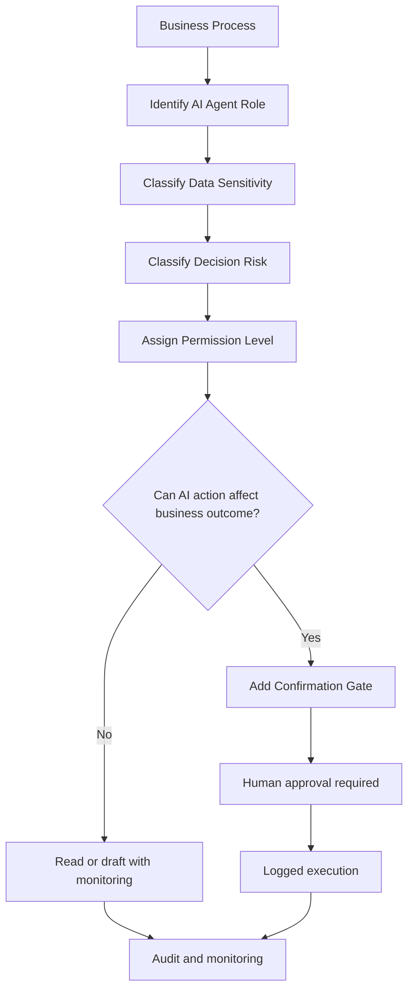

# Agent Permission Boundary Pattern

The Agent Permission Boundary is an architecture pattern for defining what an AI agent is allowed to access, prepare, recommend, or execute inside a business process.

It prevents AI agents from receiving broad, unclear, or excessive permissions before the organization has defined responsibility, risk, auditability, and human control.

## Core Idea

> An AI agent should never receive more permission than the business process can responsibly control.

AI agents may be useful because they can connect tools, read information, prepare outputs, and support workflows.

But without clear permission boundaries, an AI agent can become a risk amplifier.

## Problem

Many AI adoption projects begin with the question:

> What can the agent do?

A more responsible question is:

> What should the agent be allowed to do, under which conditions, with which data, and under whose responsibility?

Without permission boundaries, an AI agent may:

- access too much data;
- act in systems it should only read;
- send messages without review;
- change records without approval;
- expose sensitive information;
- create unclear accountability;
- trigger workflows that humans cannot properly monitor;
- combine small permissions into high-impact actions.

## Permission Levels

Use permission levels to define the AI agent's role clearly.

| Permission Level | Description | Typical Use | Human Control |
|---|---|---|---|
| No Access | AI has no access to the system or data | Sensitive or irrelevant systems | Not applicable |
| Read Only | AI may read or summarize information | Knowledge search, reporting, triage | Review for important outputs |
| Draft Only | AI may prepare text, records, or forms but cannot submit them | Email drafts, report drafts, pre-filled forms | Human review required |
| Recommend Only | AI may suggest actions but cannot prepare or execute them | Risk flags, prioritization, anomaly detection | Human decision required |
| Prepare for Approval | AI may prepare an action for explicit human confirmation | Workflow tasks, customer replies, invoice entries | Confirmation Gate required |
| Execute After Approval | AI may execute only after authorized human approval | Sending approved email, updating approved record | Logged approval required |
| Autonomous Low-Risk | AI may act without approval only in low-risk reversible cases | Internal tagging, non-binding routing | Monitoring and audit required |
| Restricted / Prohibited | AI may not perform the action | Payments, legal decisions, high-risk HR decisions | Formal governance required |

## When to Use

Use this pattern whenever AI agents are connected to:

- email systems;
- document repositories;
- CRM systems;
- ERP or accounting systems;
- HR systems;
- customer support platforms;
- workflow automation tools;
- ticketing systems;
- databases;
- APIs;
- internal knowledge systems.

## Basic Flow

## Design Requirements

A responsible Agent Permission Boundary should define:

### 1. Data Access Scope

Specify which data the AI may access and which data is excluded.

Examples:

- may read current customer email;
- may not access full customer history unless required;
- may not access payment data;
- may not access unrelated employee records.

### 2. Tool Access Scope

Specify which tools or systems the AI may use.

Examples:

- may search internal knowledge base;
- may draft an email;
- may create a draft task;
- may not send email;
- may not update accounting records;
- may not approve payments.

### 3. Action Scope

Define what the agent can produce.

Examples:

- summary;
- classification;
- recommendation;
- draft;
- pre-filled form;
- proposed workflow step.

### 4. Execution Boundary

Define where AI must stop.

For meaningful business actions, the agent should stop before execution and wait for human approval.

### 5. Human Approval Rules

Define:

- who may approve;
- what they are approving;
- what context they must see;
- whether they can edit or reject;
- whether approval must be logged;
- when escalation is required.

### 6. Audit Logging

Store enough information to understand what happened.

Useful audit elements:

- input data used by the agent;
- tool calls or systems accessed;
- AI output;
- proposed action;
- human reviewer;
- approval or rejection decision;
- final executed action;
- timestamp;
- error or override reason.

## Example: Customer Email Agent

A customer email agent may be allowed to:

- read one incoming email;
- summarize the message;
- classify the topic;
- suggest priority;
- draft a reply.

The same agent should not be allowed to:

- send the reply without approval;
- offer refunds autonomously;
- make legal promises;
- access unrelated customer data;
- change contract records.

Recommended permission level:

> Prepare for Approval.

A human customer service employee reviews and approves before sending.

## Example: Invoice Processing Agent

An invoice processing agent may be allowed to:

- read invoice files;
- extract invoice fields;
- flag missing information;
- suggest accounting categories;
- prepare a review screen.

The same agent should not be allowed to:

- book invoices autonomously in the official accounting system;
- approve payments;
- change supplier bank details;
- bypass accountant review.

Recommended permission level:

> Draft Only or Prepare for Approval.

## Example: Internal Knowledge Agent

An internal knowledge agent may be allowed to:

- search approved internal documents;
- summarize relevant passages;
- provide source references;
- answer low-risk operational questions.

The same agent should not be allowed to:

- expose confidential documents to unauthorized users;
- answer legal or HR questions as final authority;
- modify source documents;
- use restricted data without permission checks.

Recommended permission level:

> Read Only with access control and source references.

## Risk-Based Permission Guidance

| Data Sensitivity | Decision Risk | Recommended Permission |
|---|---|---|
| Low | Low | Read Only, Draft Only, or Autonomous Low-Risk |
| Medium | Low / Medium | Draft Only or Prepare for Approval |
| Medium | High | Recommend Only or Prepare for Approval with strict gate |
| High | Medium | Recommend Only or Draft Only with mandatory review |
| High | High | Support Only, Recommend Only, or Restricted |
| Critical | Critical | Restricted / Prohibited unless formal governance exists |

## Anti-Patterns

Avoid these designs:

### 1. Broad Tool Access

The agent can access many systems because it is technically possible, not because the business process requires it.

### 2. Hidden Execution

The agent triggers actions that users do not clearly understand or cannot review.

### 3. Symbolic Approval

A human clicks approve without enough context, time, authority, or responsibility.

### 4. Permission Creep

The agent starts with a small role, but gradually receives more permissions without renewed risk review.

### 5. Mixed Responsibility

Nobody can clearly explain whether the human, manager, vendor, IT team, or AI system is responsible for the final outcome.

## Good Implementation Principle

> Permissions should be granted from responsibility, not from technical capability.

Before giving an AI agent access to a tool or system, define:

- why access is needed;
- what value it creates;
- what risk it introduces;
- who controls it;
- what must be logged;
- where the agent must stop.

## Relation to the Framework

The Agent Permission Boundary connects several core ideas of Responsible AI Business Architecture:

- human responsibility;
- data minimization;
- least privilege;
- confirmation gates;
- auditability;
- risk-based autonomy;
- compliance-by-design;
- deterministic responsibility zones.

It helps organizations prevent AI agents from becoming uncontrolled actors inside business systems.

## Key Statement

> An AI agent should not be powerful by default.  
> It should be useful within clearly defined responsibility boundaries.
