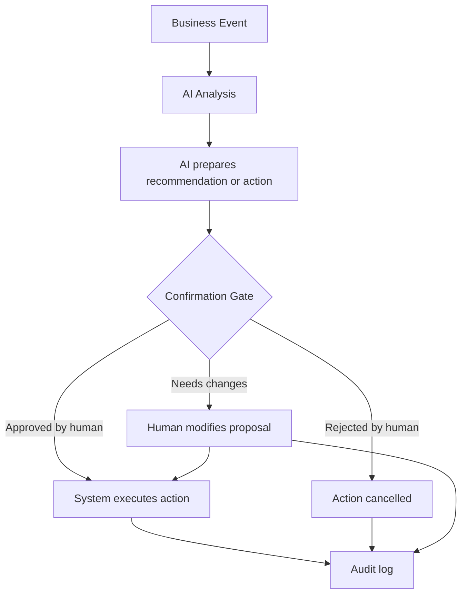

# Confirmation Gate Pattern

The Confirmation Gate is an architecture pattern for responsible AI integration.

It allows an AI system to prepare or recommend an action, but prevents the AI from executing critical changes without explicit human approval.

## Core Idea

> AI may prepare an action.  
> A responsible human must confirm the action.  
> The system executes only after confirmation.  
> The decision path is logged.

This pattern is especially important when AI interacts with business processes that may create legal, financial, operational, safety, or reputational consequences.

## Why This Pattern Matters

AI systems are probabilistic. Even when they are useful, they may misunderstand context, hallucinate, overgeneralize, or act on incomplete data.

In a business environment, a wrong action can create serious consequences:

- sending an incorrect message to a customer
- approving a wrong payment
- modifying a critical database record
- exposing sensitive information
- triggering a workflow that affects employees, customers, or suppliers

The Confirmation Gate creates a controlled boundary between AI-generated proposals and real-world business actions.

## Basic Flow

## Example: Customer Email Response

1. A customer sends an email.
2. AI summarizes the message and drafts a reply.
3. The draft is shown to a responsible employee.
4. The employee reviews, edits, approves, or rejects the draft.
5. Only after approval is the email sent.
6. The system logs the original message, AI draft, final version, approver, and timestamp.

## Example: Invoice Processing

1. AI extracts invoice data.
2. AI suggests accounting categories.
3. A human accountant reviews the extracted data.
4. The accountant confirms or corrects the proposal.
5. Only then is the invoice booked into the accounting system.
6. Corrections are logged for future quality improvement.

## Example: Payment Risk

For payment approval, the Confirmation Gate should be strict.

AI may:

- detect anomalies
- highlight suspicious payments
- compare invoice data
- recommend additional review

AI should not autonomously approve or execute payments unless the process is extremely low-risk, reversible, and explicitly authorized by governance rules.

## When to Use

Use a Confirmation Gate when AI output may lead to:

- financial transactions
- customer communication
- changes in official records
- legal consequences
- access to sensitive data
- operational disruption
- reputational damage
- decisions affecting people

## When It May Not Be Needed

A Confirmation Gate may be unnecessary for low-risk AI tasks such as:

- internal tagging
- non-binding summarization
- draft generation without sending
- internal search assistance
- low-impact task routing

Even then, logging and monitoring may still be useful.

## Human Responsibility

The Confirmation Gate must clearly define:

- who is allowed to approve
- what exactly is being approved
- which data was used
- what the AI recommended
- what the human changed
- who is accountable after approval

Without clear responsibility, the gate becomes only a user interface step, not a governance mechanism.

## Design Requirements

A useful Confirmation Gate should include:

### 1. Clear AI Proposal

The human reviewer must see what the AI is proposing and why.

### 2. Context Display

The reviewer should have access to relevant source data, documents, or conversation history.

### 3. Action Preview

The system should show what will happen if the action is approved.

### 4. Reject and Edit Options

The human must be able to reject, edit, or request re-analysis.

### 5. Audit Log

The system should store:

- AI input
- AI output
- human reviewer
- approval or rejection decision
- timestamp
- final executed action

### 6. Permission Boundary

Only authorized people should be able to approve specific actions.

### 7. Feedback Loop

Human corrections should be used to improve prompts, rules, workflows, or model evaluation processes.

## Risk-Based Gate Strength

| Risk Level | AI Role | Human Control | Execution |
|---|---|---|---|
| Low | Summarize or classify | Optional review | May be automatic |
| Medium | Prepare or recommend | Human review required | After approval |
| High | Recommend only | Mandatory responsible approval | No autonomous execution |
| Critical | Support analysis only | Multiple approval or formal process | Restricted or prohibited |

## Anti-Pattern

A bad implementation looks like this:

> AI recommends an action, the interface shows an "Approve" button, but the human has no context, no time, no clear responsibility, and no ability to understand the consequences.

This creates the illusion of human oversight without real control.

## Good Implementation Principle

> A Confirmation Gate is not a button.  
> It is a responsibility boundary.

## Relation to the Framework

The Confirmation Gate connects several core ideas of Responsible AI Business Architecture:

- human-in-the-loop
- accountability
- risk-based autonomy
- auditability
- deterministic responsibility zones
- compliance-by-design
- socio-technical architecture

It helps organizations introduce AI into business processes without allowing probabilistic systems to directly control high-impact actions.
