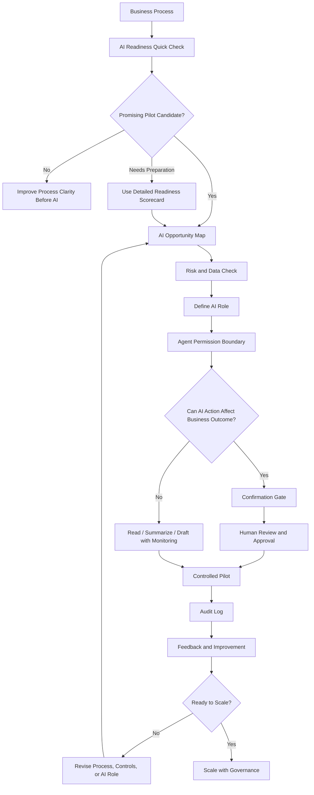

# Framework Flow

This diagram shows the basic flow of the Responsible AI Business Architecture framework.

The goal is to move from a vague AI idea to a controlled, measurable, and accountable AI pilot.

## High-Level Flow



## What Each Step Means

### 1. Business Process

Start with a concrete process, not an AI tool.

Examples:

- customer email triage;
- invoice processing;
- internal knowledge search;
- support ticket routing;
- reporting;
- document review.

### 2. AI Readiness Quick Check

Use the 3-minute quick check to see whether the idea is worth exploring.

[AI Readiness Quick Check](../lead-magnet/ai-readiness-quick-check.md)

### 3. Detailed Readiness Scorecard

If the quick check shows potential but some risks are unclear, use the detailed scorecard.

[AI Pilot Readiness Scorecard](../templates/ai-pilot-readiness-scorecard.md)

### 4. AI Opportunity Map

Map where AI can create value and where it may create risk.

[AI Opportunity Map](../business-diagnosis/ai-opportunity-map.md)

### 5. Risk and Data Check

Clarify:

- what data AI needs;
- how sensitive the data is;
- what happens if AI is wrong;
- whether mistakes are reversible;
- whether the process affects money, customers, employees, legal obligations, safety, or reputation.

### 6. Define AI Role

Decide whether AI may:

- summarize;
- classify;
- extract;
- search;
- draft;
- recommend;
- prepare for approval;
- execute only after approval;
- act autonomously only in low-risk reversible cases.

### 7. Agent Permission Boundary

Define what the AI agent may access, prepare, recommend, or execute.

[Agent Permission Boundary Pattern](../architecture-patterns/agent-permission-boundary.md)

### 8. Confirmation Gate

If AI output can affect a meaningful business outcome, add a human approval boundary.

[Confirmation Gate Pattern](../architecture-patterns/confirmation-gate.md)

### 9. Controlled Pilot

Start small.

A responsible first pilot should be:

- limited in scope;
- measurable;
- reversible;
- useful for real employees;
- designed with human oversight;
- supported by audit logging.

### 10. Audit Log

Store enough information to understand what happened:

- input data;
- AI output;
- human reviewer;
- human edits;
- approval or rejection;
- final action;
- timestamp;
- error or override reason.

### 11. Feedback and Improvement

Use feedback from the pilot to improve:

- process design;
- prompts;
- permissions;
- confirmation gates;
- audit requirements;
- training;
- success metrics.

### 12. Scale with Governance

Scale only when the organization understands:

- the process;
- the value;
- the risks;
- the data boundaries;
- the human control model;
- the responsibility structure;
- the audit requirements.

## Simple Summary

```text
Business Process
→ Quick Check
→ Opportunity Map
→ Risk and Data Check
→ AI Role
→ Permission Boundary
→ Confirmation Gate
→ Controlled Pilot
→ Audit and Feedback
→ Responsible Scaling
```

## Key Principle

> Do not scale AI before you understand responsibility.

Responsible AI scaling begins with a controlled pilot, clear human accountability, and evidence from real use.
