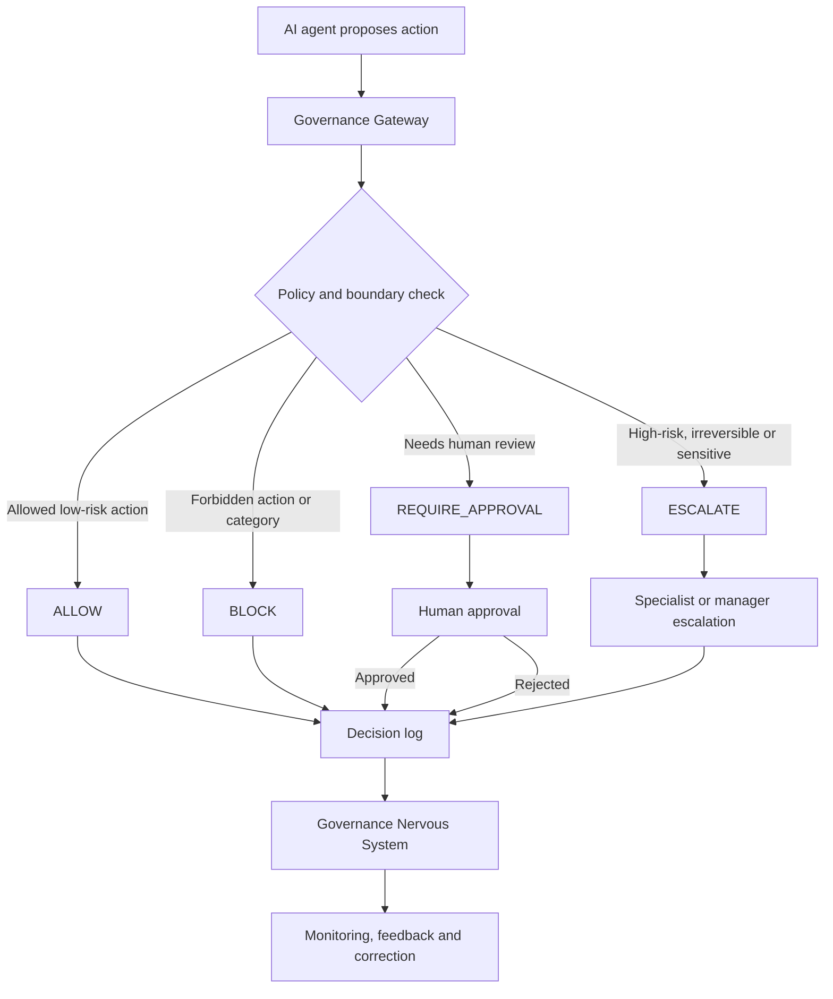

# Governance Gateway Flow

## Purpose

This diagram shows the basic decision flow of an AI Governance Gateway.

It translates the project idea into a simple operational control pattern:

```text
AI proposes an action
        ↓
Governance Gateway checks policy, risk and action boundary
        ↓
The action is allowed, blocked, routed to approval or escalated
        ↓
The decision is logged
```

---

## Flow Diagram



---

## Decision Types

| Decision | Meaning |
|---|---|
| `ALLOW` | The proposed AI action is inside the approved boundary and can proceed |
| `BLOCK` | The proposed AI action is not allowed by policy, category or action boundary |
| `REQUIRE_APPROVAL` | A human must review and approve before the action can proceed |
| `ESCALATE` | The action requires specialist, manager, legal, safety or higher-level review |

---

## What the Gateway Should Check

A Governance Gateway should check at least:

- action type;
- agent identity;
- execution mode;
- risk category;
- customer or human impact;
- reversibility;
- cost or operational threshold;
- tool permission;
- data sensitivity;
- whether human approval is required;
- whether escalation is required;
- whether the decision is logged.

---

## Relation to the Executable Demo

This diagram maps directly to the executable proof layer:

```text
examples/governance-gateway-demo/
```

The demo implements the same control pattern in code:

```text
sample-agent-actions.json
        ↓
governance-policy.json
        ↓
governance-gateway.js
        ↓
ALLOW / BLOCK / REQUIRE_APPROVAL / ESCALATE
        ↓
decision-log-example.json
```

Run the demo:

```bash
node examples/governance-gateway-demo/governance-gateway.js
```

Run the tests:

```bash
node --test examples/governance-gateway-demo/governance-gateway.test.js
```

---

## Why This Matters

A Governance Gateway is the control point between AI capability and operational action.

Without such a gateway, AI may move from recommendation to execution without clear responsibility, approval or traceability.

The goal is not to stop all AI autonomy.

The goal is to make autonomy governable.

> Before AI acts, define where AI is allowed to act.
>
> Before autonomy scales, make responsibility executable.
