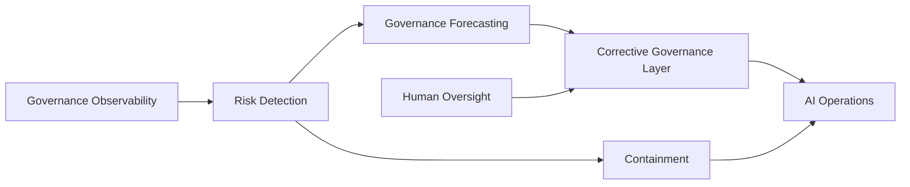

# Governance Observability

## Responsible AI Business Architecture

> Organizations must not only observe AI autonomy.
> They must remain capable of influencing it.

---

# Purpose

This document defines the concept of Governance Observability for AI-enabled organizations.

The objective is to move beyond simple monitoring toward:

- operational awareness;
- controllability sensing;
- governance forecasting;
- corrective intervention;
- adaptive human oversight.

---

# Core Principle

AI governance is not only about detecting problems.

It is about preserving the organization's ability to:

- understand;
- influence;
- redirect;
- contain;
- stabilize

autonomous operational behavior.

---

# Governance Observability

Governance observability means:

> the ability to continuously perceive the operational state of AI-enabled systems, governance integrity, escalation quality, and controllability health.

---

# Traditional Monitoring vs Governance Observability

| Traditional Monitoring | Governance Observability |
|---|---|
| Infrastructure uptime | Operational controllability |
| CPU and memory | Governance health |
| API latency | Escalation integrity |
| Error rates | Drift detection |
| System availability | Human accountability |
| Throughput | Governability of autonomy |

---

# Governance Nervous System

Governance observability functions as a nervous system for AI-enabled organizations.

## Governance Nervous System Functions

| Function | Purpose |
|---|---|
| Detection | Identify abnormal or risky behavior |
| Escalation | Transfer uncertainty to humans |
| Observability | Maintain operational awareness |
| Correction | Redirect unsafe operational behavior |
| Containment | Stop dangerous execution |
| Adaptation | Improve governance responses over time |

---

# Key Governance Observability Components

## 1. Governance Timeline

Tracks changes affecting controllability over time.

### Example Events

- permission expansion;
- blocked suspicious instructions;
- delayed approvals;
- MCP connector changes;
- audit degradation;
- escalation failures.

### Purpose

Reveal governance dynamics instead of isolated events.

---

## 2. Owner Trust Score

Measures confidence in operational governability.

### Example Dimensions

| Dimension | Example |
|---|---|
| Approval Integrity | Reliability of human approvals |
| Audit Completeness | Availability of reconstructable evidence |
| MCP Reliability | Connector governance quality |
| Drift Stability | Resistance to governance erosion |
| Prompt Governance Stability | Instruction consistency |

### Purpose

Measure trust in controllability rather than trust in AI intelligence.

---

## 3. AI Operational Pressure Index

Measures pressure placed on governance systems by increasing autonomy.

### Example Signals

- rising approval volume;
- increasing write actions;
- connector expansion;
- escalation backlog growth;
- workflow complexity increase.

### Purpose

Detect governance overload before visible failure occurs.

---

## 4. Escalation Congestion Monitoring

Measures governance response saturation.

### Example Signals

- delayed approvals;
- ignored escalations;
- approval fatigue;
- review quality degradation.

### Purpose

Detect weakening human oversight.

---

## 5. Governance Health Forecasting

Predicts future governance degradation risks.

### Example Inputs

- rising escalation latency;
- increasing permission requests;
- growing autonomy scope;
- audit coverage decline;
- connector instability.

### Purpose

Enable anticipatory governance.

---

# Corrective Governance Layer

## Core Principle

Governance systems should not only observe autonomy.

They should possess controlled corrective influence over autonomous operational behavior.

---

# Corrective Governance Objective

The goal is not suppressing AI autonomy.

The goal is guiding autonomy toward:

- governable behavior;
- constructive operational patterns;
- controllable execution;
- value-aligned outcomes;
- stable escalation integrity.

---

# Corrective Governance Capabilities

## Example Capabilities

| Capability | Purpose |
|---|---|
| Slowdown Mode | Reduce execution speed during elevated risk |
| Temporary Permission Reduction | Limit operational authority |
| Escalation Intensification | Increase human review frequency |
| Workflow Redirection | Route actions into safer operational paths |
| Isolation Mode | Separate suspicious workflows |
| Additional Verification | Trigger secondary validation |
| Supervised Execution Mode | Increase oversight during instability |
| Partial Containment | Limit operational spread |

---

# Corrective Governance Philosophy

Corrective governance should:

- shape autonomy;
- stabilize operations;
- reduce destructive patterns;
- preserve adaptability;
- avoid unnecessary suppression.

---

# Governance Influence Model

---

# Strategic Interpretation

The future challenge is not merely building autonomous AI.

The deeper challenge is preserving humanity's ability to influence autonomy after autonomy scales.

---

# Strategic Principle

Mature AI governance should not only detect harmful autonomy.

It should provide controlled corrective levers that help autonomy evolve safely.
