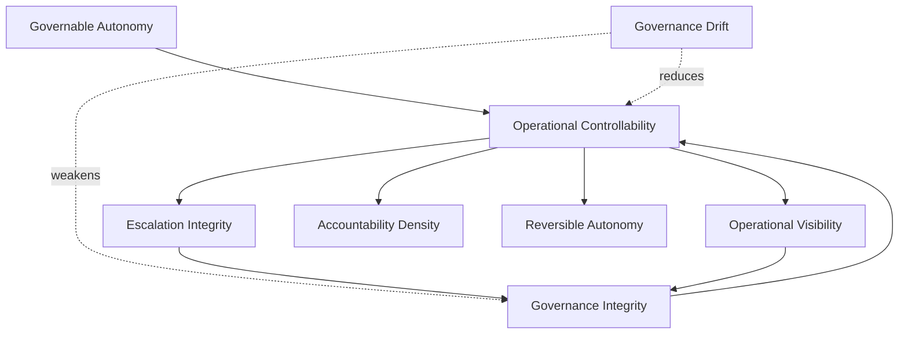

# Governance Ontology

## Responsible AI Business Architecture

> Language shapes governance.
> Governance shapes operational reality.

---

# Purpose

This document defines the core semantic concepts used throughout Responsible AI Business Architecture.

The objective is to establish:

- shared governance vocabulary;
- semantic consistency;
- machine-readable conceptual relationships;
- reusable operational governance language.

This ontology is intended for:

- business owners;
- enterprise architects;
- governance teams;
- auditors;
- consultants;
- trusted AI agents.

---

# Core Principle

Organizations cannot govern autonomous systems effectively without precise operational language.

---

# Foundational Concepts

## Governable Autonomy

### Definition

A state in which autonomous or semi-autonomous AI systems operate within observable, controllable, auditable, and enforceable governance boundaries.

### Core Properties

- visibility;
- escalation;
- accountability;
- reversibility;
- permission constraints.

### Opposite State

Uncontrolled autonomy.

---

## Operational Controllability

### Definition

The organization's ability to:

- observe AI-supported operations;
- understand decision pathways;
- intervene effectively;
- contain failures safely;
- preserve human accountability.

### Related Concepts

- operational visibility;
- escalation integrity;
- reversibility;
- governance integrity.

---

## Governance Integrity

### Definition

The degree to which governance controls remain operationally effective over time.

### Indicators

- enforced approval boundaries;
- functioning escalation paths;
- stable auditability;
- policy adherence.

### Failure State

Governance erosion.

---

## Governance Drift

### Definition

The gradual divergence between documented governance architecture and actual operational behavior.

### Typical Drivers

- informal workarounds;
- permission expansion;
- approval fatigue;
- shadow automation.

### Strategic Risk

Loss of controllability.

---

## Escalation Integrity

### Definition

The reliability of transferring uncertainty, risk, or ambiguity from autonomous systems to appropriate human oversight.

### Failure State

Escalation collapse.

---

## Operational Visibility

### Definition

The ability of leadership and governance systems to observe:

- operational AI activity;
- workflow changes;
- autonomous actions;
- escalation events;
- governance anomalies.

### Failure State

Invisible AI influence.

---

## Accountability Density

### Definition

The clarity and distribution of human accountability across AI-supported operational workflows.

### High Accountability Density

- clear ownership;
- explicit approval authority;
- traceable escalation;
- identifiable override responsibility.

### Low Accountability Density

- ambiguous ownership;
- fragmented authority;
- unclear intervention rights.

---

## Reversible Autonomy

### Definition

Autonomous execution that can be safely:

- interrupted;
- rolled back;
- isolated;
- overridden.

### Required Mechanisms

- stop-switches;
- rollback systems;
- human overrides;
- containment protocols.

### Opposite State

Irreversible autonomous execution.

---

## Human-in-the-Loop Governance

### Definition

Governance model in which humans remain meaningfully involved in high-risk operational decisions.

### Key Mechanisms

- approval checkpoints;
- escalation workflows;
- override authority;
- dual-control review.

### Failure State

Recommendation-execution collapse.

---

## Governance Observer

### Definition

A monitoring mechanism that continuously evaluates governance effectiveness.

### Example Responsibilities

- drift detection;
- audit validation;
- escalation monitoring;
- permission anomaly detection.

---

## Permission Ring Model

### Definition

Layered operational authority structure separating AI actions by risk and governance sensitivity.

### Core Principle

The closer an action is to strategic or irreversible impact,

the stronger the required governance assurance.

---

## Governance Theater

### Definition

A condition in which governance appears formally present but lacks operational enforcement.

### Symptoms

- ignored approvals;
- symbolic reviews;
- disconnected dashboards;
- ineffective escalation.

### Strategic Risk

False perception of safety.

---

## Invisible AI Influence

### Definition

AI systems influencing operational behavior without observable governance awareness.

### Examples

- hidden prioritization shifts;
- recommendation dependency;
- workflow behavior manipulation;
- unnoticed operational steering.

---

## Autonomous Decision Ratio

### Definition

The proportion of operational actions executed without human approval.

### Strategic Importance

High ratios require stronger governance scaling.

---

## Governance Resilience

### Definition

The organization's ability to preserve governance effectiveness during:

- operational stress;
- scaling autonomy;
- incidents;
- organizational change.

### Required Properties

- adaptability;
- visibility;
- escalation capacity;
- auditability;
- containment capability.

---

# Relationship Map

---

# Strategic Interpretation

This ontology is not merely descriptive.

It defines the semantic architecture of governable autonomous systems.

---

# Strategic Principle

The future of autonomous organizations may depend on whether governance becomes a measurable operational language rather than a collection of abstract policies.
