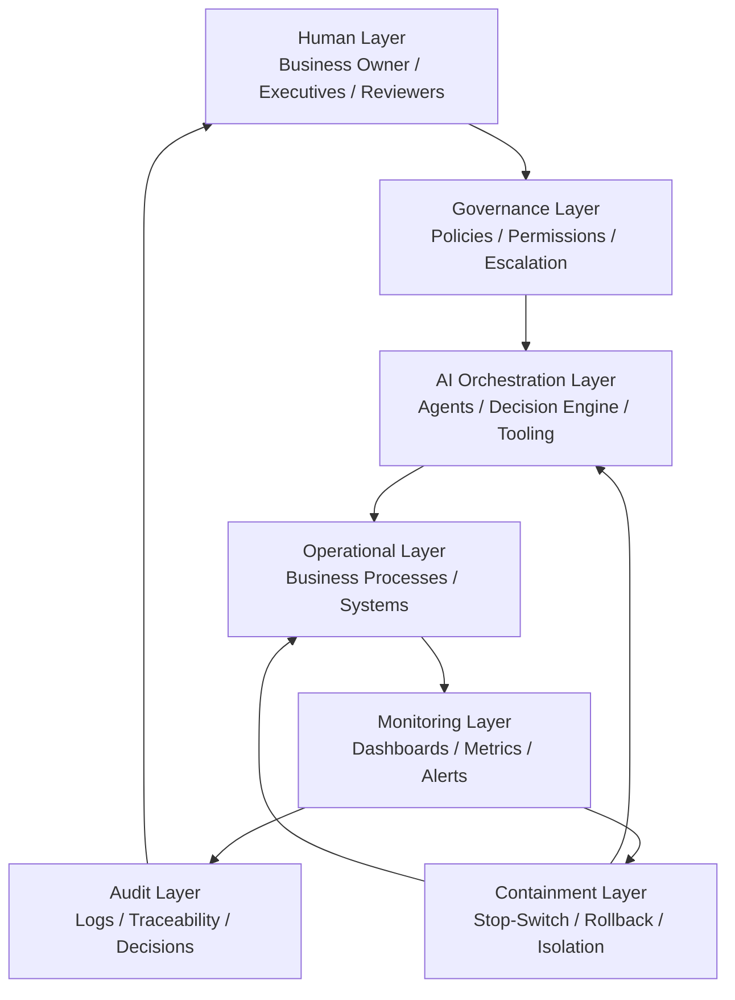
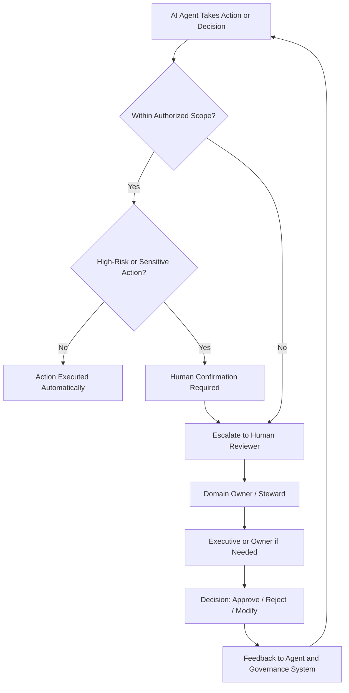
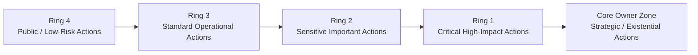
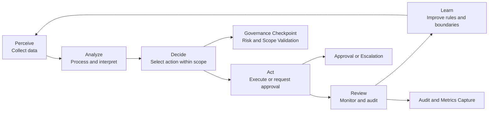
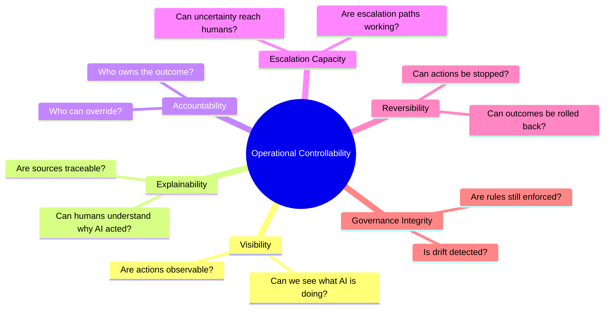
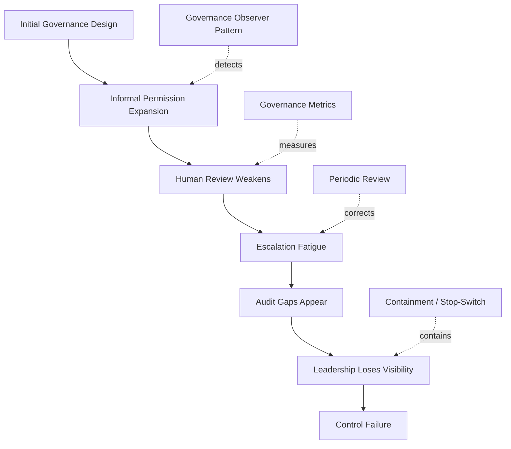
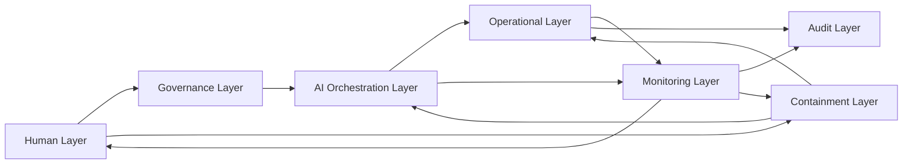

# Visual Architecture Layer

## Responsible AI Business Architecture

> Visual governance structures help humans and AI agents understand controllability faster.

---

# Purpose

This document provides visual, machine-readable architecture diagrams for Responsible AI Business Architecture.

The goal is to make the framework easier to understand for:

- business owners;
- enterprise architects;
- governance teams;
- trusted AI agents;
- consultants;
- auditors;
- implementation partners.

---

# 1. AI Governance Reference Architecture

---

# 2. Escalation Flow

---

# 3. Permission Ring Model

## Principle

The closer an action is to the core, the fewer actors may execute it and the stronger the required human assurance.

---

# 4. AI Decision Lifecycle

---

# 5. Controllability Model

---

# 6. Governance Drift Over Time

---

# 7. Information, Escalation and Feedback Flows

---

# Strategic Interpretation

These diagrams are not only visual aids.

They are semantic architecture objects.

They help both humans and AI agents understand:

- where authority resides;
- how escalation works;
- how containment is triggered;
- how visibility is preserved;
- how controllability is maintained.

---

# Strategic Principle

If governance cannot be visualized,

it will be difficult to operate, audit, and scale.
