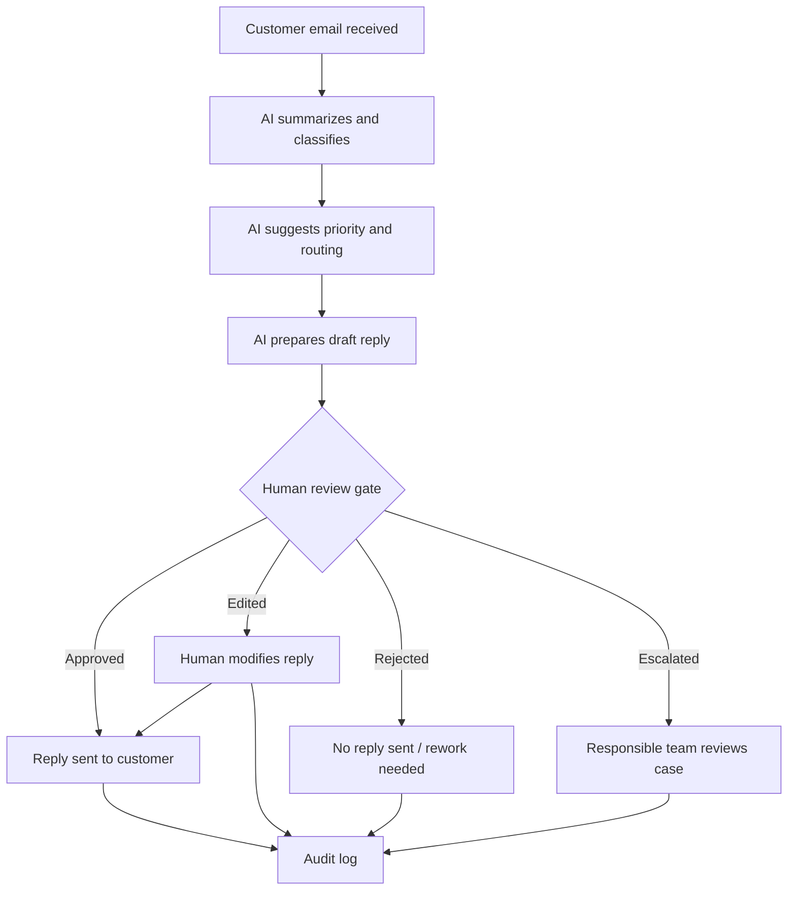

# Example: AI-Assisted Customer Email Triage Pilot

This example shows how the Responsible AI Business Architecture framework can be applied to customer email handling.

The goal is not to let AI autonomously represent the organization.

The goal is to help employees understand, prioritize, and respond to customer messages faster while preserving human responsibility, review, and control.

## 1. Business Context

Many organizations receive large volumes of customer emails.

Typical tasks include:

- reading incoming messages;
- identifying urgent requests;
- categorizing topics;
- forwarding messages to the right team;
- finding relevant customer or order information;
- drafting replies;
- tracking unresolved cases;
- escalating complaints or legal requests;
- reporting recurring problems to management.

This process often depends on manual attention and individual employee experience.

## 2. Current Problems

Common problems may include:

- important emails are missed;
- urgent cases are not prioritized;
- similar questions are answered repeatedly;
- employees spend time sorting messages instead of solving problems;
- tone and quality of replies are inconsistent;
- unclear cases are sent to the wrong team;
- complaint escalation is delayed;
- management has poor visibility into recurring issues.

## 3. AI Opportunity

AI can support customer email triage by:

- summarizing incoming messages;
- classifying topics;
- detecting urgency;
- identifying sentiment or complaint signals;
- suggesting routing to the correct team;
- drafting possible replies;
- highlighting missing information;
- detecting legal, financial, or sensitive topics;
- preparing a daily or weekly overview of recurring issues.

## 4. AI Role

For the first pilot, AI should not send replies autonomously.

Recommended AI role:

> Summarize, classify, prioritize, and prepare drafts for human review.

AI may prepare support for action.

A responsible employee must review and approve any message before it is sent to a customer.

## 5. Data Sensitivity

Customer email data usually has medium data sensitivity.

It may include:

- names;
- addresses;
- contact details;
- order information;
- complaints;
- payment references;
- contract information;
- health, legal, or other sensitive details in some cases.

The pilot should apply data minimization and access control.

AI should only access the information required for the specific task.

## 6. Decision Risk

Decision risk depends on the type of email and the action taken.

| Action | Risk Level | AI Autonomy |
|---|---|---|
| Summarize incoming email | Low / Medium | AI may suggest |
| Classify topic | Low / Medium | AI may suggest |
| Detect urgency | Medium | Human validation for important cases |
| Draft reply | Medium | Human approval required before sending |
| Offer refund or compensation | High | Human decision required |
| Handle legal complaint | High / Critical | AI support only, escalation required |
| Send customer reply | Medium / High | Only after human approval |

## 7. Required Human Control

The pilot should include a Confirmation Gate before any customer-facing communication is sent.

The human reviewer should be able to:

- see the original email;
- see the AI summary;
- see the proposed category and priority;
- see the AI-drafted reply;
- edit the draft;
- reject the draft;
- escalate the case;
- approve sending only when appropriate.

## 8. Confirmation Gate Flow

## 9. Audit Requirements

The system should log:

- original customer message;
- AI summary;
- AI classification;
- AI draft;
- human reviewer;
- human edits;
- approval or rejection decision;
- escalation decision;
- timestamp;
- final message sent;
- reason for escalation or rejection where relevant.

## 10. Responsibility Model

| Role | Responsibility |
|---|---|
| AI system | Summarizes, classifies, prioritizes, drafts |
| Customer service employee | Reviews, edits, approves, rejects, escalates |
| Customer service lead | Defines categories, escalation rules, and quality criteria |
| DPO / compliance role | Reviews data protection and access boundaries |
| IT / architecture role | Implements access control, logging, and integration boundaries |

## 11. Pilot Scope

A safe first pilot should be limited.

Recommended scope:

- one shared customer service mailbox;
- limited categories of incoming messages;
- no autonomous sending;
- no automatic refund decisions;
- no autonomous legal or contractual decisions;
- human approval for every outgoing message;
- short pilot period;
- clear success metrics.

Example pilot:

> AI summarizes and classifies customer emails, suggests priority, and drafts replies. Employees review and approve every outgoing message before sending.

## 12. Success Metrics

Measure whether the pilot improves the process.

Possible metrics:

- average first response time;
- number of emails correctly categorized;
- number of urgent cases detected;
- time spent drafting replies;
- percentage of drafts accepted after minor edits;
- number of escalations handled correctly;
- customer service employee satisfaction;
- number of missed or delayed important messages;
- quality review score of final replies.

## 13. Red Flags

Do not scale the pilot if:

- employees approve drafts without reading them;
- AI misses urgent complaints;
- AI drafts legally risky or misleading replies;
- escalation rules are unclear;
- audit logs are incomplete;
- customer data is exposed too broadly;
- employees feel pressured to trust the AI output;
- response speed improves but quality or responsibility decreases.

## 14. First Pilot Recommendation

The safest first version is:

> AI-assisted email summarization, classification, prioritization, and draft preparation with mandatory human approval before sending.

Avoid in the first version:

- autonomous customer replies;
- autonomous refunds or compensation offers;
- autonomous legal interpretations;
- broad access to unrelated customer data;
- replacing customer service responsibility with AI output.

## 15. Framework Interpretation

This example demonstrates the central idea of Responsible AI Business Architecture:

AI can improve speed and consistency, but only if the organization defines responsibility boundaries before automation.

The process must define:

- what AI may summarize;
- what AI may recommend;
- what AI may draft;
- who reviews;
- who approves;
- what must be escalated;
- what is logged;
- how quality is measured;
- when scaling is allowed.

## Key Statement

> AI may help prepare communication.  
> The organization remains responsible for what is sent.
