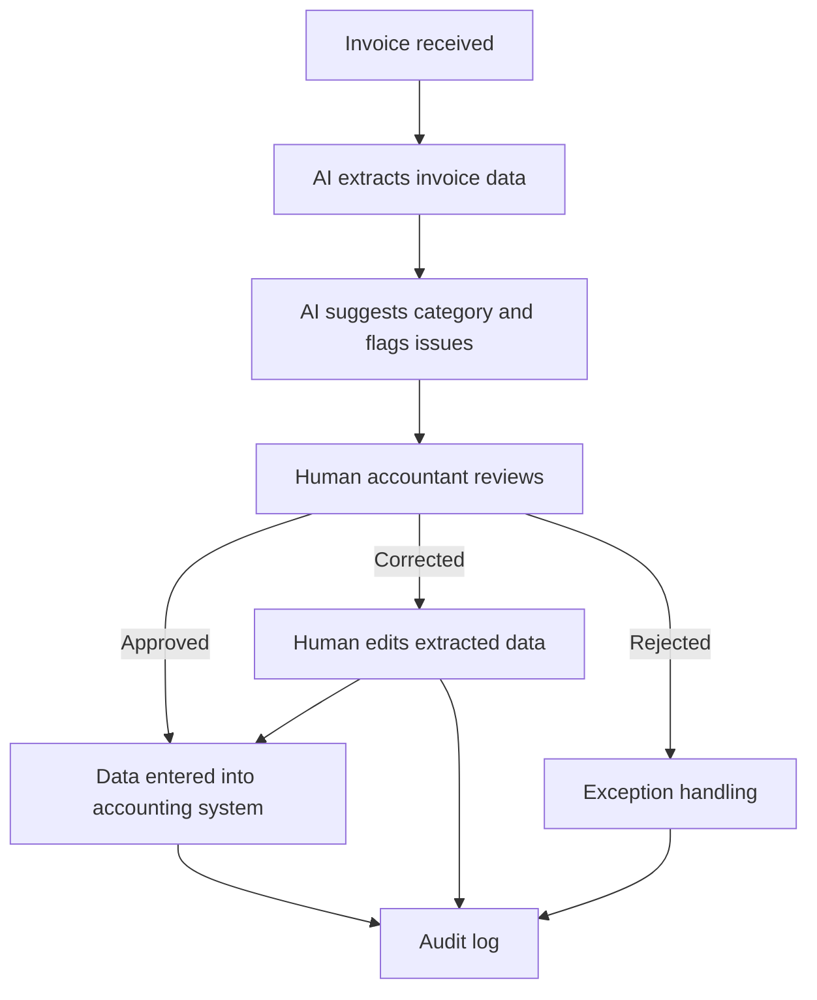

# Example: AI-Assisted Invoice Processing Pilot

This example shows how the Responsible AI Business Architecture framework can be applied to a practical business process: invoice processing.

The goal is not to fully automate accounting decisions from the beginning.

The goal is to design a safe first AI pilot that reduces manual work while preserving human responsibility, auditability, and control.

## 1. Business Context

Many organizations process incoming invoices manually.

Typical tasks include:

- receiving invoices by email or upload;
- opening attachments;
- reading supplier data;
- extracting invoice numbers, dates, amounts, tax information, and payment terms;
- assigning accounting categories;
- checking for duplicates;
- sending unclear cases to review;
- entering information into accounting or ERP systems.

This process is often repetitive, time-consuming, and error-prone.

## 2. Current Problems

Common problems may include:

- slow processing time;
- manual data entry;
- inconsistent invoice formats;
- missing or unclear information;
- duplicate invoices;
- delayed approvals;
- lack of process visibility;
- unclear responsibility for exceptions;
- late reporting to management.

## 3. AI Opportunity

AI can support the process by:

- reading invoice documents;
- extracting key fields;
- classifying invoice types;
- detecting missing information;
- identifying possible duplicates;
- suggesting accounting categories;
- preparing a review screen for a human accountant;
- creating a draft management summary of invoice status.

## 4. AI Role

For the first pilot, AI should not autonomously book invoices or approve payments.

Recommended AI role:

> Prepare for human review.

AI may extract and suggest.

A human accountant must review, correct, and approve before data is entered into the official accounting system.

## 5. Data Sensitivity

Invoice processing usually involves medium to high data sensitivity.

It may include:

- supplier information;
- customer information;
- bank details;
- tax numbers;
- payment terms;
- contract references;
- business-confidential financial data.

Because of this, the pilot must define clear data access boundaries.

## 6. Decision Risk

Decision risk is medium to high, depending on the action.

| Action | Risk Level | AI Autonomy |
|---|---|---|
| Extract invoice date | Low / Medium | AI may suggest |
| Extract invoice amount | Medium | Human review required |
| Suggest accounting category | Medium | Human review required |
| Detect duplicate invoice | Medium / High | AI may flag, human decides |
| Book invoice into accounting system | High | Human approval required |
| Approve payment | High / Critical | AI should not approve autonomously |

## 7. Required Human Control

The pilot should include a Confirmation Gate.

AI prepares structured invoice data, but a human accountant must confirm before the data is used in official accounting records.

The human reviewer should be able to:

- see the original invoice;
- see extracted fields;
- see AI suggestions;
- edit incorrect values;
- reject the AI output;
- send the invoice to exception handling;
- approve the final structured data.

## 8. Confirmation Gate Flow

## 9. Audit Requirements

The system should log:

- original invoice file;
- AI-extracted fields;
- AI confidence or uncertainty signals if available;
- human reviewer;
- corrections made by the human;
- approval or rejection decision;
- timestamp;
- final values entered into the accounting system;
- exception reason if rejected.

## 10. Responsibility Model

| Role | Responsibility |
|---|---|
| AI system | Extracts, classifies, suggests, flags issues |
| Accountant | Reviews, corrects, approves, rejects |
| Finance manager | Defines approval rules and escalation paths |
| DPO / compliance role | Reviews data protection and access boundaries |
| IT / architecture role | Implements security, logging, and integration controls |

## 11. Pilot Scope

A safe first pilot should be limited.

Recommended scope:

- one department;
- one invoice mailbox;
- limited supplier group;
- no autonomous payment approval;
- human review for every invoice;
- clear success metrics;
- short test period.

Example pilot:

> AI extracts invoice data from incoming PDF invoices and prepares a review screen for accountants. No booking or payment is executed without human confirmation.

## 12. Success Metrics

Measure whether the pilot improves the process.

Possible metrics:

- average invoice processing time;
- number of manual fields entered per invoice;
- number of extraction errors;
- number of duplicate invoices detected;
- time spent on exception handling;
- accountant satisfaction;
- percentage of invoices processed within target time;
- reduction of delayed invoices.

## 13. Red Flags

Do not scale the pilot if:

- data extraction is unreliable;
- accountants do not trust or understand the AI output;
- responsibility for approval is unclear;
- audit logs are incomplete;
- sensitive data access is too broad;
- AI suggestions are accepted without review;
- exceptions are not handled properly;
- the process becomes faster but less controllable.

## 14. First Pilot Recommendation

The safest first version is:

> AI-assisted invoice data extraction with mandatory human review and full audit logging.

Avoid in the first version:

- autonomous booking;
- autonomous payment approval;
- broad ERP write access;
- using sensitive financial data without clear access rules;
- replacing accounting responsibility with AI output.

## 15. Framework Interpretation

This example demonstrates the central idea of Responsible AI Business Architecture:

AI can improve speed and reduce manual work, but only if it is integrated into a controlled business architecture.

The process must define:

- what AI may do;
- what AI may not do;
- who reviews;
- who approves;
- what is logged;
- what is measured;
- how errors are handled;
- when scaling is allowed.

## Key Statement

> The first goal is not full automation.  
> The first goal is controlled assistance with measurable value and clear responsibility.
