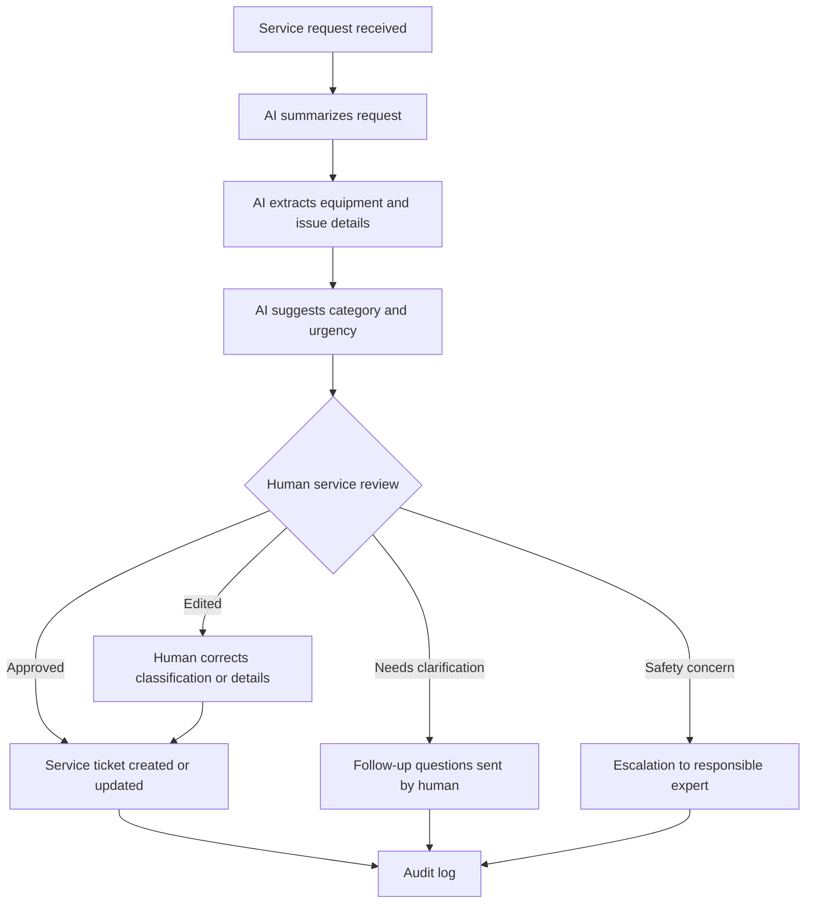

# Example: AI-Assisted Rehab Equipment Service Request Triage

This example shows how the Responsible AI Business Architecture framework can be applied to service and maintenance requests for rehab equipment and assistive devices.

The goal is not to let AI decide technical, medical, safety, or contractual outcomes.

The goal is to help a service organization receive, understand, prioritize, route, and prepare service requests faster while preserving human responsibility, technical review, customer trust, and operational control.

## 1. Business Context

Organizations that service rehab equipment and assistive devices may receive requests from:

- customers;
- patients or users;
- relatives;
- care facilities;
- nursing homes;
- clinics;
- therapists;
- insurance providers;
- internal service teams;
- suppliers;
- field technicians.

Requests may involve:

- electric wheelchairs;
- manual wheelchairs;
- powered add-ons;
- patient lifts;
- adjustable beds;
- seating systems;
- mobility aids;
- spare parts;
- repairs;
- maintenance;
- safety concerns;
- delivery or pickup coordination.

The organization must often understand the request quickly and route it to the right person, technician, supplier, or internal process.

## 2. Current Problems

Common problems may include:

- requests arrive through many channels;
- important details are missing;
- urgent cases are mixed with routine cases;
- service teams spend time reading and sorting messages;
- technicians receive incomplete information;
- spare parts are not identified early enough;
- customers wait for clarification;
- safety-related issues may need faster escalation;
- documentation is inconsistent;
- management lacks visibility into recurring service problems.

## 3. AI Opportunity

AI can support the process by:

- summarizing incoming service requests;
- classifying request type;
- identifying equipment category;
- extracting key details;
- detecting missing information;
- suggesting urgency level for human review;
- routing requests to the right team;
- preparing a service ticket draft;
- suggesting follow-up questions;
- identifying possible safety-related language;
- preparing a weekly overview of recurring issues.

## 4. AI Role

For the first pilot, AI should not make final technical, safety, medical, contractual, or billing decisions.

Recommended AI role:

> Summarize, classify, extract, flag, and prepare for human review.

AI may help structure the request.

A responsible employee, dispatcher, service coordinator, technician, or manager must review important cases before action is taken.

## 5. Data Sensitivity

Service requests in this domain may include medium to high sensitivity data.

They may contain:

- customer names;
- addresses;
- phone numbers;
- care facility names;
- equipment details;
- serial numbers;
- repair history;
- insurance references;
- mobility limitations;
- health-related context;
- urgent safety-related information.

Because of this, the pilot should apply data minimization, access control, and clear permission boundaries.

AI should only access information required for the specific service triage task.

## 6. Decision Risk

Decision risk depends on the action.

| Action | Risk Level | AI Autonomy |
|---|---|---|
| Summarize service request | Low / Medium | AI may suggest |
| Classify equipment category | Medium | Human validation for unclear cases |
| Detect missing information | Low / Medium | AI may suggest follow-up questions |
| Suggest urgency | Medium / High | Human review required |
| Flag possible safety issue | High | AI may flag, human decides |
| Create service ticket draft | Medium | Human review recommended |
| Assign technician | Medium | Human confirmation recommended |
| Decide repair method | High | Technician decision required |
| Decide safety-critical action | High / Critical | Human expert decision required |
| Approve billing or insurance action | Medium / High | Human approval required |

## 7. Required Human Control

The pilot should include human review before any meaningful operational action.

Human review is especially important when the request involves:

- possible safety risk;
- immobile or highly dependent users;
- urgent equipment failure;
- powered mobility devices;
- patient lifts;
- braking or electrical issues;
- medical or health-related context;
- billing, warranty, or insurance questions;
- unclear technical descriptions.

The human reviewer should be able to:

- see the original request;
- see the AI summary;
- see extracted details;
- see missing information;
- see proposed classification;
- edit the ticket;
- reject the AI suggestion;
- escalate the case;
- assign the request to the correct responsible person.

## 8. Suggested Triage Categories

AI may suggest categories such as:

- repair request;
- maintenance request;
- urgent mobility issue;
- safety-related concern;
- spare part request;
- delivery / pickup coordination;
- warranty or billing question;
- unclear request / needs clarification;
- supplier issue;
- technician follow-up required.

These categories should be reviewed and adapted by the organization.

## 9. Confirmation Gate Flow

## 10. Audit Requirements

The system should log:

- original request;
- AI summary;
- extracted equipment details;
- AI category suggestion;
- AI urgency suggestion;
- missing information flags;
- human reviewer;
- human corrections;
- approval or escalation decision;
- final ticket content;
- timestamp;
- reason for escalation where relevant.

## 11. Responsibility Model

| Role | Responsibility |
|---|---|
| AI system | Summarizes, classifies, extracts, flags missing or urgent information |
| Service coordinator | Reviews, corrects, prioritizes, routes, escalates |
| Technician | Makes technical repair assessment and repair decisions |
| Service manager | Defines triage rules, escalation paths, and quality criteria |
| DPO / compliance role | Reviews data protection and access boundaries |
| IT / architecture role | Implements secure access, logging, and system integration boundaries |

## 12. Agent Permission Boundary

For a first pilot, the AI system should have narrow permissions.

Recommended permission level:

> Draft only or Prepare for approval.

AI may:

- read incoming service request text;
- summarize the request;
- classify the issue;
- extract equipment information;
- draft a service ticket;
- suggest follow-up questions;
- flag possible urgency or safety concern.

AI should not:

- send messages without human approval;
- assign safety-critical priority as final decision;
- decide repair method;
- order parts autonomously;
- approve billing or warranty decisions;
- access unrelated customer or health data;
- change official records without review.

Use:

[Agent Permission Boundary Pattern](../architecture-patterns/agent-permission-boundary.md)

## 13. Pilot Scope

A safe first pilot should be limited.

Recommended scope:

- one service mailbox or request channel;
- one equipment category or limited set of categories;
- AI creates draft triage only;
- no autonomous customer communication;
- no autonomous technician assignment for urgent or safety cases;
- human review for all AI-generated tickets;
- short pilot period;
- clear success metrics.

Example pilot:

> AI summarizes incoming service requests, extracts equipment and issue details, suggests a triage category, and prepares a draft service ticket. A human service coordinator reviews every ticket before routing or action.

## 14. Success Metrics

Possible metrics:

- average time from request received to ticket prepared;
- percentage of requests correctly categorized;
- number of missing-information cases detected;
- number of urgent cases flagged for human review;
- reduction in back-and-forth clarification;
- technician satisfaction with ticket completeness;
- service coordinator satisfaction;
- number of misrouted tickets;
- customer response time;
- visibility into recurring equipment issues.

## 15. Red Flags

Do not scale the pilot if:

- AI misclassifies urgent or safety-related requests;
- human reviewers approve AI suggestions without reading the original request;
- service tickets become faster but less accurate;
- sensitive data access is too broad;
- escalation paths are unclear;
- technicians do not trust the ticket quality;
- audit logs are incomplete;
- AI suggestions are treated as final technical decisions;
- customers receive AI-generated communication without human approval.

## 16. First Pilot Recommendation

The safest first version is:

> AI-assisted service request summarization, classification, and draft ticket preparation with mandatory human review before routing or action.

Avoid in the first version:

- autonomous safety decisions;
- autonomous technician dispatch for critical issues;
- autonomous customer communication;
- autonomous ordering of parts;
- autonomous billing or insurance decisions;
- broad access to unrelated customer, health, or financial data.

## 17. Framework Interpretation

This example demonstrates the central idea of Responsible AI Business Architecture:

AI can improve speed, visibility, and service coordination, but it must not replace human responsibility in technical, safety-sensitive, customer-facing, or regulated decisions.

The process must define:

- what AI may summarize;
- what AI may classify;
- what AI may draft;
- where a human must review;
- where a human must approve;
- what must be escalated;
- what data AI may access;
- what should be logged;
- how quality is measured;
- when scaling is allowed.

## Key Statement

> In rehab equipment service, AI may help the organization see the request faster.  
> It must not replace the human responsibility to understand the user's need, technical context, and safety implications.
